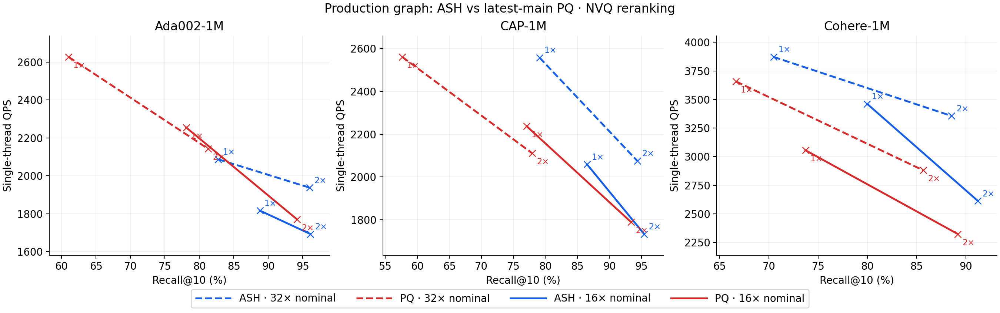
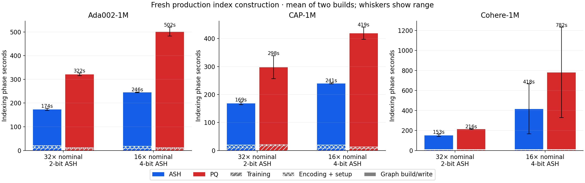
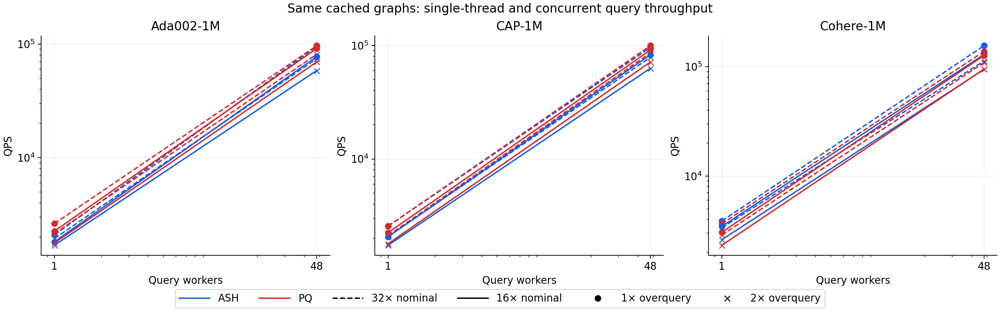
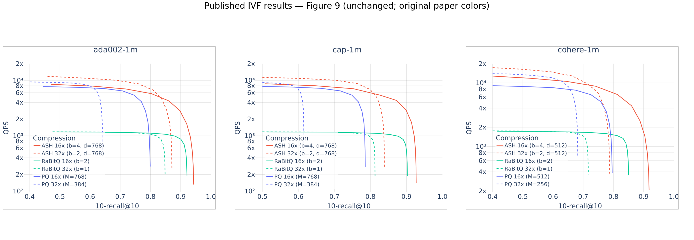

# Production ASH versus latest-main PQ: Figure 9 graph study

Completed 24 fresh builds and 24 cached-index concurrency passes. ASH has higher mean recall at **12/12** matched query operating points, higher mean single-thread QPS at **4/12**, and faster graph construction plus scorer setup in **6/6** configurations. These counts summarize the measured points; they do not imply a universal winner at matched recall.

The new symmetric scorer is used for encoded-node comparisons during construction. Production ASH queries remain asymmetric and include raw-query projection. Neither branch includes the separate duplicate-ID fix.

## Recommendation

Keep the corrected symmetric scorer for construction and asymmetric scoring for raw queries. At these measured settings, ASH improves recall in every comparison and builds faster, but it has not universally beaten PQ on query throughput: Ada and CAP still have a throughput gap. Cohere wins both query metrics, while its original construction outlier remains unexplained. Prioritize measured score-kernel and ThreadLocal overhead before changing graph pruning policy; keep deduplication experiments separate.

## Plots







## Published IVF reference



The reference panels retain the paper’s original colors (red ASH, blue PQ); the new graph plots use blue ASH and red PQ. No IVF benchmark was rerun. These are architectural comparisons, with material differences: graph ASH uses C=1 and 20D training, while paper IVF uses C=32 and 10D; graph PQ uses JVector 8-bit ADC while paper PQ uses Faiss 4-bit FastScan; the graph runs use NVQ reranking. Increasing graph overquery also enlarges its search candidate set, so its gain is not solely a reranking ablation.

## Integration and validation

[Branch audit](branch-audit.md) records the completed work integrated into ash-dev. The production baseline is unchanged from the original frozen ASH JAR; the byte-write fix was present throughout. Scalar and SIMD regression executions each passed 33 tests.

## Cohere construction investigation

The first 4-bit Cohere runs were anomalous. Their timings are retained in the primary tables and ranges; they are not silently replaced with faster repeats. The integrated ash-dev code is identical to the frozen ASH production code used for those runs.

| Cohere 4-bit run | ASH graph build/write | PQ graph build/write |
|---|---:|---:|
| Primary repetition 1, no JFR | 658.45 s | 1,224.67 s |
| Primary repetition 2, short JFR capture | 158.05 s | 320.37 s |
| Additional control, no startup JFR | 203.34 s | 350.11 s |

ASH's first/second insertion times were 511.91/89.53 seconds; cleanup 82.69/5.49 seconds; flush 63.85/63.03 seconds. This localizes that anomaly to graph computation rather than the bulk byte-write fix or SSD flush throughput. The extra control's insertion/cleanup/flush times were 105.59/5.58/92.17 seconds.

### What the evidence establishes

- The byte-write fix is present in the actual frozen JAR. No production-code change caused the faster second repetition.
- Source dispatch and live profiles use the intended SIMD kernels for d=512. There is no dimension-based Java dispatch to a scalar ASH kernel. This does not by itself guarantee that every Vector API operation is optimally compiled.
- During the monitored Cohere runs there was ample available memory, no swap, and zero sampled memory-pressure PSI. Each build used a fresh JVM. The pre-resume host had 340 GiB available and no benchmark JVM running. These observations cannot reconstruct the complete system state of the first repetition.
- Full-JVM GC pause totals in the monitored runs were 0.93–2.48 seconds. Large allocation volumes exist, particularly in the 2-bit PQ run, but long stop-the-world pauses do not explain the monitored build costs. JFR shows boxed Vector API objects and array allocation, including NVQ's nvqLoss path. The sampled allocation weights are estimates, not exact per-method allocation accounting.
- The active PQ construction implementation is ImmutablePQVectors' cached centroid-pair lookup. In its 4-bit profile, assembleAndSumPQ_512 was the top frame in 54.1% of execution samples, ThreadLocal.get in 25.2%, and assembleAndSum512 in 14.2%. ASH's 4-bit profile was concentrated in packed asymmetric projection scoring and symmetric packed comparisons. These are sampled CPU-stack proportions, not an exact wall-time decomposition.
- Hardware cycles/instructions/cache counters are not exposed by this VM's perf interface. Therefore these measurements do not distinguish execution throughput from cache/memory stalls precisely. Historical sar files were stale and did not cover the first runs.

### Diagnostic comparison counts

A separate diagnostic class counted actual pair evaluations while preserving the pruning decisions and score arithmetic. It was not added to production code. Cohere-100k is a scale control, not a substitute for measuring the original 1M execution history.

| Method / budget | Prune calls | Candidate checks | Pair comparisons | Diagnostic build/write |
|---|---:|---:|---:|---:|
| ASH 2-bit | 661,994 | 87,840,870 | 1,503,229,262 | 13.27 s |
| ASH 4-bit | 667,048 | 91,887,956 | 1,504,819,172 | 16.91 s |
| PQ matching 2-bit | 669,293 | 82,090,179 | 1,535,016,576 | 16.10 s |
| PQ matching 4-bit | 673,297 | 87,645,603 | 1,539,002,008 | 36.35 s |

Pair counts barely change with bit budget in this control. It supports the expected increase in cost per score, rather than a multiplicative increase in pair count at this scale. It does not identify the cause of the historical 1M outlier.

One initial diagnostic completed its build but failed in post-build reporting because an empty throughput key still enabled the benchmark. The configuration was corrected by omitting that key and the four diagnostics were rerun successfully. The failed attempt remains archived separately and is excluded from the table above.

### Remaining limitation

The first 1M outlier has not yet been causally explained. A missing byte-write fix and a fixed dimensionality fallback are not supported by the evidence. Runtime compilation and execution-state effects remain hypotheses; the original runs lacked the relevant GC/JIT/system traces. The additional controls completed without reproducing the large slowdown. Their full-JVM GC pauses totaled 0.676 seconds for ASH and 1.651 seconds for PQ; available memory stayed above 321/318 GiB, respectively, with zero sampled memory-pressure PSI. Compilation logs recorded class-loading/retry events, but those events alone establish neither a persistent kernel compilation failure nor the cause of the first outlier. No speculative production fix was applied. Do not use the outlying Cohere mean as a precise capacity-planning estimate.


## Timing validation

The predeclared rule retimed any case/JVM with a sample CV above 10%, using both overquery settings and at least 10 seconds per sample (three samples). Four cached-index JVMs were retimed. All recall and visited-count values matched the originals exactly. No reconstruction was performed. These longer observations supply QPS in the reported tables; original observations remain in results.csv and in the original columns of reported-results.csv.

| Case | Overquery | Original QPS | Longer QPS | Original CV | Longer CV |
|---|---:|---:|---:|---:|---:|
| ada002-1M-b4-pq-r2 | 1× | 1,821 | 2,214 | 30.7% | 2.7% |
| ada002-1M-b4-pq-r2 | 2× | 1,588 | 1,697 | 14.3% | 0.6% |
| cap-1M-b2-ash-r2 | 1× | 2,258 | 2,672 | 23.8% | 6.6% |
| cap-1M-b2-ash-r2 | 2× | 2,053 | 2,181 | 2.7% | 1.4% |
| cap-1M-b4-pq-r2 | 1× | 1,997 | 2,463 | 18.8% | 5.7% |
| cap-1M-b4-pq-r2 | 2× | 1,628 | 1,937 | 15.1% | 0.9% |
| cohere-english-v3-1M-b4-ash-r1 | 1× | 2,915 | 3,660 | 18.9% | 3.3% |
| cohere-english-v3-1M-b4-ash-r1 | 2× | 2,319 | 2,653 | 2.8% | 0.8% |


# Final graph results

Means of two independent builds per configuration. ASH/PQ values are shown in that order.

## Single-threaded queries

| Dataset | ASH bits / PQ matching budget | Overquery | Recall@10 (%): ASH / PQ | QPS: ASH / PQ | ASH/PQ QPS | Recall difference (pp) |
|---|---:|---:|---:|---:|---:|---:|
| ada002-1M | 2 | 1× | 82.724 / 61.028 | 2,087 / 2,627 | 0.79× | +21.696 |
| ada002-1M | 2 | 2× | 95.969 / 81.254 | 1,938 / 2,143 | 0.90× | +14.715 |
| ada002-1M | 4 | 1× | 88.771 / 78.085 | 1,817 / 2,255 | 0.81× | +10.686 |
| ada002-1M | 4 | 2× | 96.114 / 94.155 | 1,693 / 1,771 | 0.96× | +1.959 |
| cap-1M | 2 | 1× | 79.109 / 57.654 | 2,557 / 2,561 | 1.00× | +21.456 |
| cap-1M | 2 | 2× | 94.369 / 77.959 | 2,075 / 2,111 | 0.98× | +16.410 |
| cap-1M | 4 | 1× | 86.525 / 77.097 | 2,059 / 2,237 | 0.92× | +9.427 |
| cap-1M | 4 | 2× | 95.438 / 93.395 | 1,734 / 1,789 | 0.97× | +2.043 |
| cohere-english-v3-1M | 2 | 1× | 70.487 / 66.674 | 3,872 / 3,657 | 1.06× | +3.813 |
| cohere-english-v3-1M | 2 | 2× | 88.550 / 85.674 | 3,356 / 2,880 | 1.17× | +2.876 |
| cohere-english-v3-1M | 4 | 1× | 79.983 / 73.727 | 3,461 / 3,055 | 1.13× | +6.255 |
| cohere-english-v3-1M | 4 | 2× | 91.210 / 89.178 | 2,612 / 2,323 | 1.12× | +2.031 |

## Construction

Graph column includes scorer-provider setup. Phase subtotal also includes compressor training, base encoding and NVQ compressor setup; it excludes dataset loading, JVM startup and uninstrumented writer initialization.

| Dataset | Bits/budget | Graph + provider seconds: ASH / PQ | Training seconds: ASH / PQ | Encoding seconds: ASH / PQ | Measured phase subtotal seconds: ASH / PQ |
|---|---:|---:|---:|---:|---:|
| ada002-1M | 2 | 156.20 / 309.93 | 9.43 / 6.69 | 7.65 / 4.73 | 173.79 / 321.90 |
| ada002-1M | 4 | 230.94 / 489.46 | 8.21 / 6.97 | 6.14 / 4.86 | 245.86 / 501.90 |
| cap-1M | 2 | 152.19 / 276.91 | 9.18 / 16.51 | 7.11 / 4.54 | 168.98 / 298.45 |
| cap-1M | 4 | 224.20 / 406.63 | 8.43 / 7.55 | 7.37 / 4.72 | 240.52 / 419.45 |
| cohere-english-v3-1M | 2 | 145.53 / 206.35 | 5.33 / 5.44 | 1.80 / 3.86 | 153.08 / 216.02 |
| cohere-english-v3-1M | 4 | 410.35 / 772.52 | 4.54 / 5.85 | 2.23 / 3.28 | 417.54 / 782.05 |

## Same cached indexes, 48 query workers

| Dataset | Bits/budget | Overquery | Concurrent QPS: ASH / PQ | Speedup over one worker: ASH / PQ |
|---|---:|---:|---:|---:|
| ada002-1M | 2 | 1× | 95,507 / 96,984 | 45.76× / 36.92× |
| ada002-1M | 2 | 2× | 74,420 / 81,508 | 38.40× / 38.03× |
| ada002-1M | 4 | 1× | 77,725 / 91,585 | 42.79× / 40.62× |
| ada002-1M | 4 | 2× | 58,574 / 69,742 | 34.60× / 39.39× |
| cap-1M | 2 | 1× | 95,767 / 99,468 | 37.45× / 38.84× |
| cap-1M | 2 | 2× | 78,606 / 85,994 | 37.88× / 40.74× |
| cap-1M | 4 | 1× | 82,883 / 91,129 | 40.26× / 40.74× |
| cap-1M | 4 | 2× | 62,894 / 71,334 | 36.28× / 39.86× |
| cohere-english-v3-1M | 2 | 1× | 155,768 / 138,016 | 40.23× / 37.74× |
| cohere-english-v3-1M | 2 | 2× | 112,761 / 109,256 | 33.60× / 37.94× |
| cohere-english-v3-1M | 4 | 1× | 129,480 / 126,769 | 37.41× / 41.49× |
| cohere-english-v3-1M | 4 | 2× | 94,590 / 95,306 | 36.21× / 41.03× |

## Between-build ranges

Ranges of two observations, not confidence intervals.

| Dataset | Bits/budget | Method | Overquery | Single-thread QPS range | Recall@10 (%) range | Graph + setup seconds range |
|---|---:|---|---:|---:|---:|---:|
| ada002-1M | 2 | ASH | 1× | 1,996–2,178 | 82.642–82.806 | 151.60–160.79 |
| ada002-1M | 2 | ASH | 2× | 1,803–2,073 | 95.953–95.985 | 151.60–160.79 |
| ada002-1M | 2 | PQ | 1× | 2,506–2,749 | 60.969–61.087 | 305.36–314.50 |
| ada002-1M | 2 | PQ | 2× | 2,071–2,215 | 81.207–81.301 | 305.36–314.50 |
| ada002-1M | 4 | ASH | 1× | 1,748–1,885 | 88.768–88.774 | 230.19–231.68 |
| ada002-1M | 4 | ASH | 2× | 1,691–1,695 | 96.112–96.117 | 230.19–231.68 |
| ada002-1M | 4 | PQ | 1× | 2,214–2,296 | 78.046–78.124 | 471.03–507.89 |
| ada002-1M | 4 | PQ | 2× | 1,697–1,844 | 94.098–94.212 | 471.03–507.89 |
| cap-1M | 2 | ASH | 1× | 2,442–2,672 | 79.039–79.180 | 147.18–157.20 |
| cap-1M | 2 | ASH | 2× | 1,969–2,181 | 94.304–94.435 | 147.18–157.20 |
| cap-1M | 2 | PQ | 1× | 2,539–2,583 | 57.475–57.832 | 235.00–318.82 |
| cap-1M | 2 | PQ | 2× | 2,102–2,119 | 77.755–78.163 | 235.00–318.82 |
| cap-1M | 4 | ASH | 1× | 1,969–2,149 | 86.483–86.566 | 221.44–226.96 |
| cap-1M | 4 | ASH | 2× | 1,710–1,757 | 95.431–95.445 | 221.44–226.96 |
| cap-1M | 4 | PQ | 1× | 2,011–2,463 | 77.078–77.117 | 384.54–428.72 |
| cap-1M | 4 | PQ | 2× | 1,642–1,937 | 93.387–93.402 | 384.54–428.72 |
| cohere-english-v3-1M | 2 | ASH | 1× | 3,712–4,032 | 70.446–70.528 | 133.48–157.58 |
| cohere-english-v3-1M | 2 | ASH | 2× | 2,991–3,721 | 88.522–88.578 | 133.48–157.58 |
| cohere-english-v3-1M | 2 | PQ | 1× | 3,555–3,760 | 66.659–66.689 | 202.06–210.65 |
| cohere-english-v3-1M | 2 | PQ | 2× | 2,755–3,005 | 85.658–85.690 | 202.06–210.65 |
| cohere-english-v3-1M | 4 | ASH | 1× | 3,263–3,660 | 79.959–80.006 | 160.09–660.61 |
| cohere-english-v3-1M | 4 | ASH | 2× | 2,572–2,653 | 91.205–91.214 | 160.09–660.61 |
| cohere-english-v3-1M | 4 | PQ | 1× | 3,054–3,057 | 73.716–73.738 | 320.37–1224.67 |
| cohere-english-v3-1M | 4 | PQ | 2× | 2,296–2,349 | 89.174–89.183 | 320.37–1224.67 |


# Figure 9 graph comparison — protocol

Authoritative host: `ted_willke@34.169.37.132`, GCP c4-standard-96-lssd. ASH source: `/home/ted_willke/jvector-ash`, `ash-symmetric-scorer` commit `922b23e3`, plus benchmark-only explicit concurrency controls, subsequently committed as `638edc37`. PQ: verified GitHub origin/main `1a86718baa2d8b72a0d134711a682875888b9646`, isolated detached worktree. Identical ThroughputBenchmark source on both. No duplicate-ID changes.

## Matrix

Three datasets: Ada002-1M (982,790 base vectors) and CAP-1M (1,000,000), both D=1536; Cohere English v3-1M (1,000,000), D=1024. Each has 10,000 queries. User confirmed d=D/2 to match Figure 9: respectively 768, 768, 512. ASH b=2 and b=4. Graph ASH requires C=1. Production training remains 20D, max25 iterations with early stopping; paper IVF uses C=32 and 10D. The study does not change production training defaults.

PQ uses production JVector K=256, uncentered, anisotropy disabled. The actual fused query path is `FusedPQDecoder.DotProductDecoder`, with float partial-sum tables and SIMD `VectorUtil.assembleAndSum`; it is not Faiss 4-bit FastScan. Match exact stored quantized-vector bytes including ASH's 5-byte header: M=197/389 for Ada002/CAP and M=133/261 for Cohere, with uneven PQ subvector dimensions supported. The nominal 32X/16X paper labels refer to payload only; actual graph code compression is slightly lower once the ASH header is counted. Faiss IVF in the paper uses packed 4-bit PQ; these are different production PQ implementations.

Graph settings: M=64, efConstruction=200, overflow1.2, hierarchy/refinement enabled, fused neighborhoods, NVQ reranking, k=10 and rerankK=10/20 (overquery1/2), search pruning disabled. ASH retains production adaptive termination gamma0.01. PQ uses latest-main behavior, which has no ASH adaptive feature. ASH writes version7, latest-main PQ version6. This is a production-branch comparison, not an isolated quantizer ablation.

## Timing and retention

Two independent fresh compressor/graph builds per configuration (24 total), reversed ASH/PQ order on repetition2. No shared compressor cache across fresh repetitions. Each index is retained and reopened for a 48-query-worker concurrency pass. Explicit serial/concurrent checks compare complete ranked node IDs, scores and visited count for all test queries at each overquery setting. Recall and visited measurements are outside the throughput timer.

Single-threaded QPS is the main result. Three timed samples, each at least3seconds and a complete query batch; raw durations and query counts logged. Existing synthetic warmup remains enabled. Query concurrency uses a dedicated 48-worker pool. Grid submits insertion to PhysicalCoreExecutor with 48 workers; GraphIndexBuilder cleanup uses its default common ForkJoinPool (normally parallelism 95 on this 96-logical-CPU JVM). Both branches use this arrangement. Workers are not explicitly pinned, unlike the paper’s 48 pinned build threads. Asymmetric projection/setup remains inside each query call for ASH. The graph uses corrected symmetric node comparisons and asymmetric raw-vector insertion/query scoring.

JDK23, vector module, native access enabled, Xmx128g, ASH SIMD single/block kernels, production accumulator/unroll settings. Explicit `jvector-twenty` classpath supplies MemorySegmentReader; reader fallback warnings are checked. Temporary files and retained indexes are on RAID10 SSDs. These1M indexes fit RAM; warmed memory-mapped query throughput is not a larger-than-memory I/O result.

Retain graph build/write time separately from training, base encoding and provider setup. Add NVQ compressor setup to these measured phases; their sum is a measured phase subtotal, excluding uninstrumented writer initialization overhead. Process elapsed time additionally includes dataset loading, JVM startup, warmup and queries and is not called construction time.

The paper uses the same GCP c4-standard-96-lssd/Intel Xeon 6985P-C host class, 48 build cores and single-thread queries. Its IVF implementation is C++/AVX-512 with 4096 lists and an nprobe sweep; this graph experiment uses Java/JDK23 and two overquery settings.

No IVF reruns. Published Figure9 panels are extracted from the supplied final PDF and shown separately from measured graph points. Any comparison across index types must retain the landmark/training/PQ implementation and reranking differences above.

Remote evidence and reusable caches: `/mnt/raid10/jvector-bench/ted_willke/figure9-graph/`. Per-case directories contain YAMLs, `index_cache`, ASH `compressor_cache` or latest-main PQ `pq_cache`, logs and completion manifests. Frozen JARs and hashes are stored at the study root.

## Interpretation

The runtime profile confirms that graph construction uses `ImmutablePQVectors.diversityFunctionFor(DOT_PRODUCT)`, which caches centroid-pair partial sums and calls `VectorUtil.assembleAndSumPQ`. The base `PQVectors` implementation is not the active diversity scorer in these runs. Corrected ASH construction compares packed codes. Query scoring remains asymmetric in both configurations.

Figure9 compares published IVF search curves. It does not report complete graph or IVF index-build times. Its ASH/PQ query paths do not use this graph's NVQ reranking configuration, so higher graph terminal recall must not be attributed solely to the quantizer. Graph construction is compared directly between the two measured graph implementations.

The exact same graph is used for each serial/concurrent comparison; independent graph repetitions are used only for build/run variability. Two repetitions provide ranges, not narrow statistical confidence intervals.

## Reusable artifacts

[Reported observations](reported-results.csv) explicitly identify longer cached-query retimings and preserve original QPS/CV columns. [Original observations](results.csv) include each build repetition, both query concurrencies, timing variation, recall, visited counts and phase times. Every retained index has its own configuration and compressor cache. The remote query-only helper is `/mnt/raid10/jvector-bench/ted_willke/figure9-graph/retest.py`. For example:

```sh
python3 /mnt/raid10/jvector-bench/ted_willke/figure9-graph/retest.py ada002-1M-b2-ash-r1 --threads 1 --overquery 1.0,2.0
```

All 48 serial/concurrent operating-point checks compare complete ranked results and visited counts for every supplied query at each index/overquery setting. Separate reported recall and visited metrics agree exactly between serial and concurrent passes. The concurrency harness is committed as `638edc37`.
